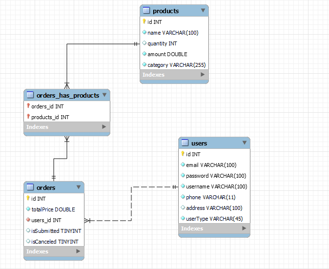

# ECommerce-SOAP-API

A simple ecommerce restful api using JAX-WS.


## Documentation

[SOAP UI](https://github.com/amiraElmergawy/ECommerce-SOAP-API/blob/main/e-commerce-api-soapui-project.xml)


## Features

- Registration and login
- Add product  ```clerk & admin```
- Edit product ```clerk & admin```
- Delete product ```clerk & admin```
- View product details
- View products
- Search for product by name and category
- Make an order
- Confirm customers' order ```clerk & admin```
- View order by id ```clerk & admin```
- View order by customer id
- View all orders ```clerk & admin```
- Cancel order
- View all clerks ```admin```
- View clerk by id ```admin```
- Edit clerk ```admin```
- Delete clerk ```admin```
- Add clerk ```admin```


## Technologies Used

- JAX-WS
- Maven
- Lombok
- Tomcat
- Jakarta persistance (Hibernate)
- MySql
- Postman


## Entity-Relationship Diagram

<p align="center">
  
</p>

## Database Schema

<p align="center">
  
</p>

## Run Locally

Clone the project

```bash
  git clone https://github.com/amiraElmergawy/ECommerce-SOAP-API
```

Go to the project directory

```bash
  cd ECommerce-SOAP-API
```

- Create db user and set the username and password values in the persistence.xml.
- Create db named ecommerce in your MySql Server.
- Run your tomcat apache server and then change the configuration of tomcat in pom.xml.
- Finally, deploy the application using the following maven command.


```bash
    mvn clean package tomcat7:deploy
```
